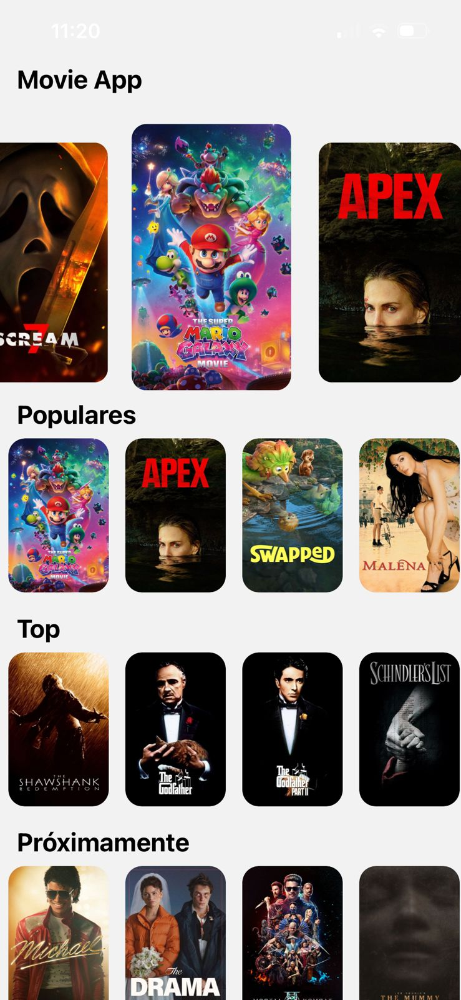
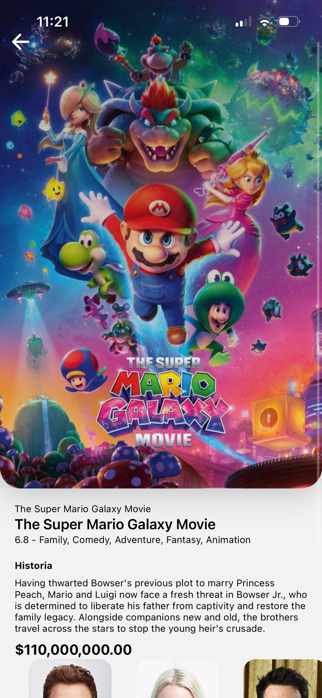
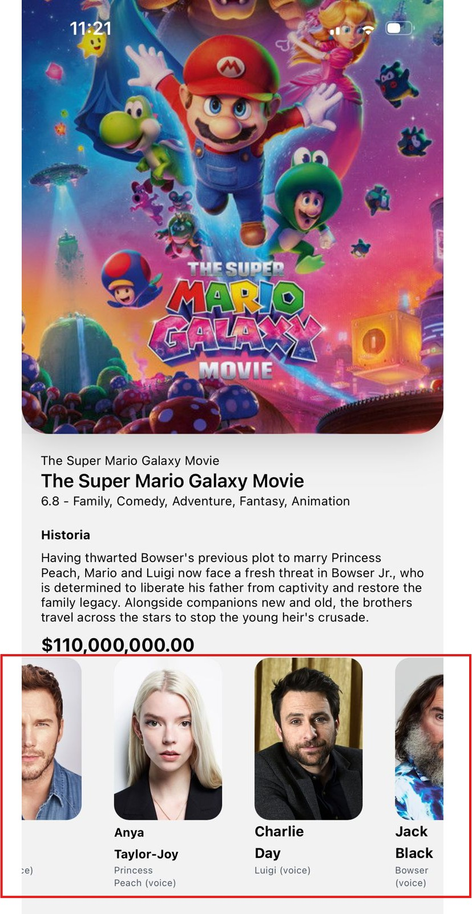

# Movies App

Aplicación móvil moderna en React Native para explorar películas, construida con **Expo** y alimentada por la [API de The Movie Database (TMDb)](https://www.themoviedb.org/). Navega por películas en cartelera, populares, mejor calificadas y próximas — con elenco completo, calificaciones, presupuesto y un carrusel animado con efecto parallax.

---

## Capturas de pantalla

| Pantalla Principal | Detalles de Película | Reparto|
|:------------------:|:-------------------:|:-------------------:|
|  |  |  |

---

## Funcionalidades

- **Carrusel Parallax** — presentación animada de películas en cartelera con transiciones suaves al deslizar
- **Listas por Categoría** — listas horizontales desplazables para Populares, Mejor Calificadas y Próximas
- **Scroll Infinito** — la lista de Mejor Calificadas carga automáticamente la siguiente página al hacer scroll
- **Detalle de Película** — póster a pantalla completa, sinopsis, géneros, calificación y presupuesto
- **Sección de Elenco** — tarjetas de actores con foto de perfil y nombre del personaje
- **Caché de 24 horas** — TanStack React Query evita llamadas innecesarias a la API
- **TypeScript** — código completamente tipado desde las respuestas de la API hasta los componentes de UI
- **Estilos con NativeWind** — clases utilitarias de Tailwind CSS aplicadas directamente en React Native

---

## Tecnologías Utilizadas

| Tecnología | Versión | Rol |
|---|---|---|
| React Native | 0.81.5 | Framework móvil |
| Expo | ~54.0.33 | Plataforma de desarrollo y compilación |
| Expo Router | ~6.0.23 | Navegación basada en archivos |
| TanStack React Query | ^5.100.9 | Fetching de datos, caché y paginación |
| Axios | ^1.16.0 | Cliente HTTP para la API de TMDb |
| NativeWind | ^4.2.3 | Tailwind CSS para React Native |
| react-native-reanimated-carousel | ^4.0.3 | Animación del carrusel parallax |
| expo-linear-gradient | ~15.0.8 | Degradados sobre las imágenes de portada |
| @expo/vector-icons | ^15.0.3 | Librería de iconos |
| TypeScript | ~5.9.2 | Tipado estático |

---

## Estructura del Proyecto

```
movies-app/
│
├── app/                            # Pantallas (enrutamiento por archivos con Expo Router)
│   ├── _layout.tsx                 # Layout raíz — configuración del proveedor de React Query
│   ├── index.tsx                   # Punto de entrada — redirige a /home
│   ├── home/
│   │   └── index.tsx               # Pantalla principal
│   └── movie/
│       └── [id].tsx                # Pantalla de detalle (ruta dinámica por ID)
│
├── core/                           # Lógica de negocio
│   ├── api/
│   │   └── movie-api.ts            # Instancia de Axios con URL base y API key
│   └── actions/
│       ├── movies/
│       │   ├── now-playing.action.ts
│       │   ├── popular.action.ts
│       │   ├── top.action.ts
│       │   ├── upcoming.action.ts
│       │   └── get-movie-by-id.action.ts
│       └── cast/
│           └── getCastByMovieId.action.ts
│
├── infraestructure/                # Modelos de datos y transformaciones
│   ├── interfaces/
│   │   ├── movie.interfaces.ts
│   │   ├── cast.interfaces.ts
│   │   ├── moviedb-response.ts
│   │   ├── moviedb-detail-response.ts
│   │   └── credits-response.ts
│   └── mappers/
│       └── movier.mapper.ts        # Transforma respuestas de TMDb al modelo de la app
│
├── presentation/                   # Capa de UI
│   ├── components/
│   │   ├── movies/                 # Componentes de la pantalla principal
│   │   │   ├── MainSlideShow.tsx
│   │   │   ├── MovieHorizontalList.tsx
│   │   │   └── MoviePoster.tsx
│   │   └── movie/                  # Componentes de la pantalla de detalle
│   │       ├── MovieHeader.tsx
│   │       ├── MovieDescription.tsx
│   │       ├── MovieCast.tsx
│   │       └── ActorCard.tsx
│   └── hooks/
│       ├── useMovies.tsx
│       ├── useMovie.tsx
│       └── useCastMovie.tsx
│
├── config/
│   └── helpers/
│       └── formatter.ts            # Formateador de moneda para mostrar el presupuesto
│
├── assets/                         # Imágenes e iconos
├── tailwind.config.js
├── app.json
└── package.json
```

---

## Pantallas

### Pantalla Principal (`/home`)

La pantalla de inicio que incluye:
- Un **carrusel parallax** con las películas actualmente en cartelera
- Tres **listas horizontales desplazables**: Populares, Mejor Calificadas (con paginación infinita) y Próximas
- Indicador de carga mientras se obtienen los datos
- Manejo de área segura para notches y barras de estado del dispositivo

### Detalle de Película (`/movie/[id]`)

Ruta dinámica que muestra la información completa de la película seleccionada:
- Imagen de fondo a pantalla completa con superposición de **degradado lineal**
- Botón de navegación para volver atrás
- Título, título original, calificación con estrellas y géneros
- Sinopsis y presupuesto formateado como moneda (USD)
- **Lista horizontal del elenco** con fotos de perfil de los actores y nombre del personaje

---

## Componentes

### Componentes de la Pantalla Principal (`presentation/components/movies/`)

| Componente | Descripción |
|---|---|
| `MainSlideShow` | Carrusel animado con efecto parallax usando `react-native-reanimated-carousel`. Muestra las películas en cartelera con gestos de deslizamiento y efectos de escala. |
| `MovieHorizontalList` | `FlatList` horizontal con soporte de scroll infinito. Detecta cuando el usuario está a menos de 600px del final y llama a `loadNextPage()`. |
| `MoviePoster` | Póster de película interactivo. Navega a `/movie/[id]` al presionar. Soporta variantes de tamaño `small` y `large` con retroalimentación visual al presionar. |

### Componentes de la Pantalla de Detalle (`presentation/components/movie/`)

| Componente | Descripción |
|---|---|
| `MovieHeader` | Imagen de póster a pantalla completa con degradado `LinearGradient`, botón de regreso, título y título original de la película. |
| `MovieDescription` | Muestra calificación con estrellas, etiquetas de género, texto de sinopsis y presupuesto formateado en USD. |
| `MovieCast` | `FlatList` horizontal que renderiza una fila de componentes `ActorCard` para todo el elenco. |
| `ActorCard` | Muestra la foto de perfil del actor, nombre completo y nombre del personaje. Usa una imagen de placeholder cuando no hay foto disponible. |

---

## Hooks Personalizados

| Hook | Retorna | Propósito |
|---|---|---|
| `useMovies()` | `nowPlayingQuery`, `popularQuery`, `upcomingQuery`, `topRatedQuery` | Obtiene todas las categorías de películas. Mejor Calificadas usa `useInfiniteQuery` para carga paginada. |
| `useMovie(id)` | `movieQuery` | Obtiene los detalles completos de una película por su ID de TMDb. |
| `useCastMovie(id)` | `castQuery` | Obtiene la lista completa del elenco de una película por su ID de TMDb. |

Todos los hooks configuran un **`staleTime` de 24 horas** — los datos en caché se reutilizan al navegar sin volver a consultar la API.

---

## Integración con la API

Esta aplicación consume la **[TMDb REST API v3](https://developer.themoviedb.org/docs)**.

### Endpoints Utilizados

| Método | Endpoint | Propósito |
|---|---|---|
| GET | `/movie/now_playing` | Películas actualmente en cartelera |
| GET | `/movie/popular` | Películas populares |
| GET | `/movie/top_rated` | Películas mejor calificadas (paginadas) |
| GET | `/movie/upcoming` | Próximas películas |
| GET | `/movie/{id}` | Detalle de una película por ID |
| GET | `/movie/{id}/credits` | Elenco y equipo de producción |

### Mapper de Datos

Las respuestas crudas de TMDb son transformadas por `MovieMapper` antes de llegar a cualquier componente de UI:
- Las URLs de pósters y fondos se prefijan con `https://image.tmdb.org/t/p/w500`
- Las imágenes faltantes de actores usan una URL de placeholder
- Solo se extraen los campos que la aplicación necesita de cada respuesta

---

## Cómo Empezar

### Requisitos Previos

- Node.js >= 18
- Expo CLI: `npm install -g expo-cli`
- Una API key gratuita de [TMDb](https://www.themoviedb.org/settings/api)
- Android Studio / Xcode para emuladores, o la app **Expo Go** en un dispositivo físico

### Instalación

```bash
# 1. Clonar el repositorio
git clone https://github.com/tu-usuario/movies-app.git
cd movies-app

# 2. Instalar dependencias
npm install
```

### Variables de Entorno

Crea un archivo `.env` en la raíz del proyecto:

```env
EXPO_PUBLIC_MOVIE_DB_URL=https://api.themoviedb.org/3/movie
EXPO_PUBLIC_MOVIE_DB_KEY=tu_api_key_de_tmdb_aqui
```

> Obtén tu API key gratuita en [https://www.themoviedb.org/settings/api](https://www.themoviedb.org/settings/api)

### Ejecutar la Aplicación

```bash
# Iniciar el servidor de desarrollo de Expo
npm start

# Ejecutar en emulador de Android
npm run android

# Ejecutar en simulador de iOS
npm run ios

# Ejecutar en el navegador web
npm run web
```

---

## Arquitectura

El proyecto sigue una **arquitectura por capas** que separa las responsabilidades claramente:

```
┌──────────────────────────────────────┐
│           Capa de Presentación        │
│   Pantallas · Componentes · Hooks    │
├──────────────────────────────────────┤
│           Core / Acciones             │
│   Llamadas a la API · Lógica         │
├──────────────────────────────────────┤
│         Capa de Infraestructura       │
│   Interfaces · Mappers · Modelos     │
└──────────────────────────────────────┘
```

- **Presentación** no conoce nada de HTTP — solo consume datos a través de hooks personalizados
- **Core / Acciones** llaman a la API de TMDb y retornan datos tipados y mapeados a los hooks
- **Infraestructura** define todas las interfaces de TypeScript y el mapper que convierte el JSON crudo en modelos limpios para la app

---

## Scripts Disponibles

| Comando | Descripción |
|---|---|
| `npm start` | Inicia el servidor de desarrollo de Expo |
| `npm run android` | Lanza en emulador de Android |
| `npm run ios` | Lanza en simulador de iOS |
| `npm run web` | Lanza en el navegador web |
| `npm run lint` | Ejecuta ESLint en todo el proyecto |

---

## 👤 Autor

**Jhonatan Jimenez Monsalve**  
— App Movie
